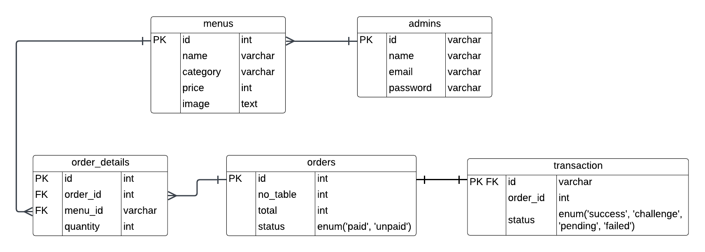

# Mini Project - Sistem Manajemen Menu dan Pesanan Restoran
Sistem Manajemen Menu dan Pesanan Restoran adalah solusi perangkat lunak yang dirancang khusus untuk membantu restoran dalam mengelola menu dan mengatur pesanan dari pelanggan. Tujuan utama dari produk ini yaitu:
* Meningkatkan efisiensi operasional
* meningkatkan pengalamanpengalaman pelanggan dalam melakukan pemesanan
* Mempermudah proses manajemen restoran

## Tech Stack
* App Framework: **Echo**
* ORM Library: **GORM**
* Database: **MySQL**
* Deployment: **Google Cloud Platform**
* Code Structure: **Clean Architecture**
* Authentication: **JWT**
* Media Management: **Cloudinary**
* Payment Gateway: **Midtrans**

## Entity Relationship Diagram

  

## API Specification
[API Specification](https://www.postman.com/lively-equinox-899238/workspace/sistem-manajemen-menu-dan-pesanan-restoran/documentation/29059809-9893ab1e-4853-4912-b420-b9dac1123834)