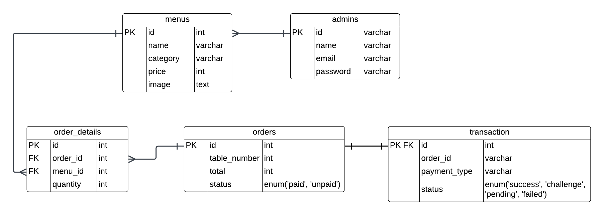

# Mini Project - Sistem Manajemen Menu dan Pesanan Restoran
Sistem Manajemen Menu dan Pesanan Restoran adalah solusi perangkat lunak yang dirancang khusus untuk membantu restoran dalam mengelola menu dan mengatur pesanan dari pelanggan. Tujuan utama dari produk ini yaitu:
* Meningkatkan efisiensi operasional
* Meningkatkan pengalaman pelanggan dalam melakukan pemesanan
* Mempermudah proses manajemen restoran

## Feature Specification
* Admin dapat login untuk mengakses fitur menambah menu, mengedit menu, dan menghapus menu
* Admin dapat menambah menu dengan item berupa nama, kategori(makanan, minuman, hidangan penutup), harga, deskripsi, dan foto menu.
* Admin dapat mengedit menu
* Admin dapat menghapus menu
* User dapat mengakses menu 
* User dapat mengelompokkan menu berdasarkan kategori(makanan, minuman, hidangan penutup)
* User dapat melihat menu yang sering dipesan
* User dapat melihat menu seperti deskripsi dan harga
* User dapat memesan berdasarkan menu yang tersedia
* User dapat melakukan pembayaran melalui payment gateway

## Tech Stack
* App Framework: **Echo**
* ORM Library: **GORM**
* Database: **MySQL**
* Deployment: **Google Cloud Platform**
* Code Structure: **Clean Architecture**
* Authentication: **JWT**
* Media Management: **Cloudinary**
* Payment Gateway: **Midtrans**

## Entity Relationship Diagram

  

## API Specification
[API Specification](https://documenter.getpostman.com/view/29059809/2sAYkErfrh)
